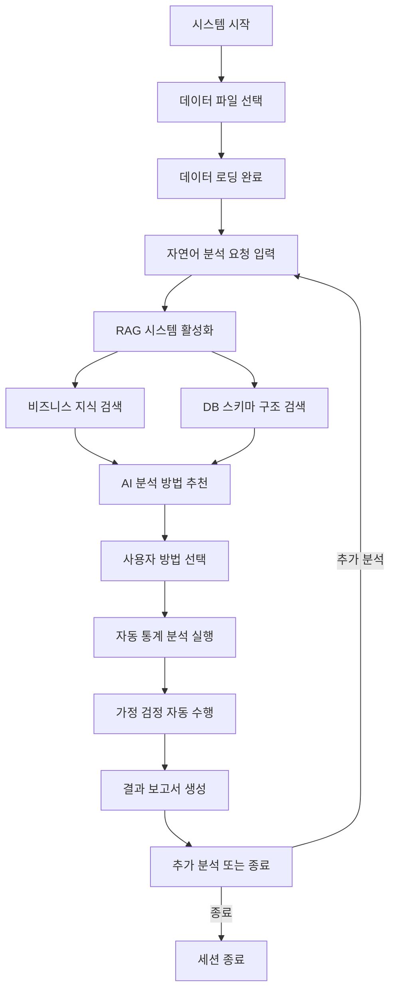

# 📊 Text-to-Statistical-Test: 비즈니스 컨텍스트 인식 AI 통계 분석 시스템

**한국어 자연어 기반 다중턴 대화형 통계 분석 자동화 시스템 with Enhanced RAG**

비즈니스 도메인 전문 지식과 데이터베이스 스키마 구조를 활용한 지능형 통계 분석 워크플로우

---

## 🚀 핵심 특징

### 📈 지능형 AI 추천 시스템
- **자연어 요청 이해**: 일반 언어로 분석 요구사항 입력
- **컨텍스트 인식 추천**: 비즈니스 도메인 지식을 바탕으로 한 AI 분석 방법 추천
- **자동 검정 수행**: 정규성, 등분산성 검정 등 통계적 가정 자동 확인

### 🏢 비즈니스 도메인 특화 RAG 시스템
- **업계 전문 지식**: 도메인별 비즈니스 용어사전 및 분석 가이드라인
- **DB 스키마 검색**: 데이터베이스 구조 및 테이블 관계 정보 활용
- **이중언어 지원**: BCEmbedding 기반 한국어-영어 크로스링구얼 검색

### 🔄 다중턴 대화 워크플로우
- **단계별 진행**: 데이터 선택 → 자연어 요청 → AI 추천 → 자동 분석
- **대화형 상호작용**: 각 단계에서 사용자와의 자연스러운 대화
- **세션 관리**: 분석 과정 전체의 컨텍스트 유지

---

## 🏗️ 시스템 아키텍처

### 📁 프로젝트 구조 및 주요 컴포넌트

```
text_to_statistical_test/
├── 📁 core/                          # 🧠 핵심 엔진
│   ├── agent.py                      # LLMAgent: 다중턴 대화 오케스트레이션
│   ├── workflow_manager.py           # WorkflowManager: 워크플로우 상태 관리
│   ├── context_manager.py            # ContextManager: 세션 컨텍스트 관리
│   └── decision_engine.py            # DecisionEngine: AI 의사결정 엔진
│
├── 📁 llm_services/                  # 🤖 LLM 서비스
│   ├── llm_client.py                 # LLMClient: OpenAI API 클라이언트
│   ├── prompt_crafter.py             # PromptCrafter: 동적 프롬프트 생성
│   └── prompts/                      # 📝 프롬프트 템플릿 모음
│
├── 📁 rag_system/                    # 🔍 Enhanced RAG 시스템
│   ├── business_retriever.py         # BusinessRetriever: 비즈니스 지식 검색 [NEW]
│   ├── schema_retriever.py           # SchemaRetriever: DB 스키마 구조 검색 [NEW]
│   └── rag_manager.py                # RAGManager: RAG 통합 관리자 [NEW]
│
├── 📁 utils/                         # 🛠️ 유틸리티
│   ├── analysis_recommender.py       # AnalysisRecommender: AI 추천 엔진
│   ├── workflow_utils.py             # 워크플로우 유틸리티 함수
│   ├── ui_helpers.py                 # UI 헬퍼 함수
│   ├── data_utils.py                 # 데이터 처리 유틸리티
│   └── system_setup.py               # 시스템 설정 유틸리티
│
├── 📁 data_processing/               # 📊 데이터 처리
│   └── data_loader.py                # DataLoader: 다양한 형식 데이터 로딩
│
├── 📁 code_execution/                # ⚡ 코드 실행
│   └── safe_code_executor.py         # SafeCodeExecutor: 안전한 코드 실행
│
├── 📁 reporting/                     # 📋 보고서 생성
│   └── report_generator.py           # ReportGenerator: 분석 결과 보고서
│
├── 📁 resources/                     # 📚 리소스
│   ├── workflow_graph.json           # 워크플로우 그래프 정의
│   └── rag_index/                   # 🏢 비즈니스 지식베이스 [NEW]
│
├── 📁 input_data/                    # 📥 입력 데이터
│   ├── data_files/                  # 실제 분석 데이터
│   └── metadata/                    # 비즈니스 컨텍스트 정보 [NEW]
│       ├── business_dictionary.json  # 업계 용어사전
│       ├── domain_knowledge.md       # 도메인 전문 지식
│       ├── analysis_guidelines.md    # 분석 가이드라인
│       └── database_schemas/         # DB 스키마 구조 정보 [NEW]
│           ├── schema_definitions.json  # 테이블 구조 정의
│           ├── relationship_maps.json   # 테이블 관계 매핑
│           └── column_descriptions.json # 컬럼 상세 설명
│
├── 📁 config/                        # ⚙️ 설정
│   └── settings.py                   # 시스템 설정 (OpenAI 전용)
│
├── 📁 logs/                          # 📜 로그
├── 📁 output_results/               # 📤 출력 결과
├── 📁 tests/                        # 🧪 테스트
│
├── main.py                          # 🚀 통합 진입점
├── setup_project.py                # 🔧 프로젝트 설정 스크립트
├── pyproject.toml                   # 📦 Poetry 의존성 관리
├── docker-compose.yml              # 🐳 Docker 컨테이너 설정
└── Dockerfile                      # 🐳 Docker 이미지 정의
```

---

## 🧠 핵심 컴포넌트 상세

### 1. 🎯 LLMAgent (core/agent.py)
**다중턴 대화형 통계 분석의 중앙 컨트롤러**

```python
class LLMAgent:
    """Multi-turn LLM Agent 기반 통계 검정 자동화 시스템의 핵심 클래스"""
    
    # 주요 메서드
    def start_session(self) -> Dict           # 세션 시작
    def process_user_input(self, input) -> Dict  # 사용자 입력 처리
    def _handle_data_selection(self) -> Dict     # 데이터 선택 처리
    def _handle_ai_recommendation_request(self) -> Dict  # AI 추천 요청 처리
    def _handle_method_confirmation(self) -> Dict        # 방법 확인 처리
    def _handle_multi_turn_interaction(self) -> Dict     # 다중턴 상호작용
```

### 2. 🔍 Enhanced RAG System

#### BusinessRetriever (rag_system/business_retriever.py) [NEW]
**비즈니스 도메인 지식 검색 엔진**

```python
class BusinessRetriever:
    """비즈니스 컨텍스트 인식 지식 검색"""
    
    def __init__(self, embedding_model="maidalun1020/bce-embedding-base_v1"):
        # BCEmbedding: 한중 이중언어 + 비즈니스 도메인 최적화
        
    def search_business_knowledge(self, query: str) -> List[Dict]
    def search_domain_terminology(self, terms: List[str]) -> Dict
    def get_analysis_guidelines(self, domain: str) -> str
```

#### SchemaRetriever (rag_system/schema_retriever.py) [NEW]
**데이터베이스 스키마 구조 검색 엔진**

```python
class SchemaRetriever:
    """DB 스키마 및 테이블 관계 정보 검색"""
    
    def __init__(self, embedding_model="maidalun1020/bce-embedding-base_v1"):
        # 스키마 구조 임베딩 및 검색 시스템
        
    def search_table_schema(self, table_name: str) -> Dict
    def search_column_relationships(self, columns: List[str]) -> List[Dict]
    def get_schema_context(self, data_columns: List[str]) -> Dict
    def find_related_tables(self, primary_table: str) -> List[Dict]
```

#### RAGManager (rag_system/rag_manager.py) [NEW]
**통합 RAG 시스템 관리자**

```python
class RAGManager:
    """비즈니스 지식 검색 + DB 스키마 검색 통합 관리"""
    
    def search_comprehensive_context(self, 
                                   natural_language_query: str,
                                   data_context: Dict) -> Dict
    def get_contextual_recommendations(self, 
                                     query: str, 
                                     business_domain: str,
                                     schema_info: Dict) -> List[Dict]
```

### 3. 🤖 AnalysisRecommender (utils/analysis_recommender.py)
**비즈니스 컨텍스트 인식 AI 추천 엔진**

```python
class AnalysisRecommender:
    """Enhanced RAG 기반 지능형 분석 방법 추천"""
    
    def generate_recommendations(self, 
                               natural_language_request: str,
                               data_summary: Dict,
                               business_context: Dict,
                               schema_context: Dict) -> List[AnalysisRecommendation]
```

### 4. 📊 DataLoader (data_processing/data_loader.py)
**다양한 데이터 형식 지원**

- **지원 형식**: CSV, Excel, JSON, Parquet
- **메타데이터 추출**: 컬럼 타입, 분포, 결측치 정보
- **스키마 매핑**: 데이터베이스 스키마 정보 연동
- **비즈니스 컨텍스트 매핑**: 데이터 딕셔너리 연동

---

## 🔄 Enhanced Workflow

### 📋 전체 워크플로우



### 🎯 단계별 상세 설명

#### 1️⃣ 데이터 선택 (Data Selection)
```bash
📁 사용 가능한 데이터 파일:
├── student_scores.xlsx - 학생 성적 데이터
├── sales_performance.csv - 영업 실적 데이터  
├── survey_data.json - 설문조사 데이터
└── custom_data.csv - 사용자 데이터

선택하신 파일: sales_performance.csv
✅ 데이터 로딩 완료 (1,200 rows, 8 columns)
```

#### 2️⃣ 자연어 분석 요청 입력
```
🗣️ 분석하고 싶은 내용을 자연어로 설명해주세요:

예시:
- "지역별 매출 차이가 통계적으로 유의한지 확인하고 싶어요"
- "고객 만족도와 재구매율 사이의 상관관계를 분석해주세요"  
- "새로운 마케팅 전략의 효과를 검증하고 싶습니다"
- "제품군별 수익성 차이를 분석해주세요"

입력: "지역별 매출 차이가 통계적으로 유의한지 확인하고 싶어요"
```

#### 3️⃣ Enhanced RAG 시스템 동작
```python
# 비즈니스 지식 검색
business_context = {
    "domain": "영업/매출 분석",
    "terminology": {
        "지역별": "지리적 세그먼테이션 분석",
        "매출 차이": "수익 변동성 분석"
    },
    "guidelines": "지역별 매출 분석 시 계절성, 인구 밀도, 경제 수준 고려 필요"
}

# DB 스키마 구조 검색
schema_context = {
    "primary_table": "sales_data",
    "key_columns": {
        "region": "VARCHAR(50) - 지역 코드 (서울:01, 부산:02, 대구:03)",
        "sales_amount": "DECIMAL(15,2) - 매출액 (원 단위)",
        "sales_date": "DATE - 매출 발생일"
    },
    "relationships": [
        "sales_data.region_id → region_master.region_id",
        "sales_data.product_id → product_master.product_id"
    ],
    "constraints": {
        "sales_amount": "NOT NULL, CHECK(sales_amount >= 0)",
        "region": "NOT NULL, FOREIGN KEY"
    }
}
```

#### 4️⃣ AI 분석 방법 추천
```
🤖 비즈니스 컨텍스트와 데이터베이스 스키마를 분석한 결과, 다음 방법들을 추천합니다:

📊 추천 분석 방법:

1. 🥇 일원분산분석 (ANOVA) - 추천도: 95%
   ├── 적용 이유: region 컬럼의 3개 카테고리(서울/부산/대구) 간 sales_amount 평균 비교 최적
   ├── 전제조건: 정규성, 등분산성 자동 검정 수행
   ├── 스키마 고려사항: region 컬럼의 FK 제약조건으로 데이터 무결성 보장
   ├── 비즈니스 해석: 지역별 매출 격차의 통계적 유의성 확인
   └── 사후검정: Tukey HSD로 구체적 차이 그룹 식별

2. 🥈 Kruskal-Wallis 검정 - 추천도: 85%  
   ├── 적용 이유: sales_amount의 CHECK 제약조건(≥0)으로 인한 분포 왜곡 가능성 대비
   ├── 장점: 분포 가정 불필요
   └── 비즈니스 해석: 비모수적 지역별 매출 순위 차이

3. 🥉 독립표본 t-검정 - 추천도: 60%
   ├── 적용 조건: region_master 테이블과 조인하여 지역을 2그룹으로 병합 시
   └── 제한사항: 다중 지역 정보 손실

선택하실 방법 번호를 입력해주세요 (1-3): 1
```

#### 5️⃣ 자동 통계 분석 실행
```
🔄 선택된 분석 방법: 일원분산분석 (ANOVA)

📋 자동 분석 진행 상황:
✅ 1. 데이터 전처리 완료
✅ 2. 정규성 검정 수행 (Shapiro-Wilk test)
   ├── 서울지역: p-value = 0.234 (정규성 만족)
   ├── 부산지역: p-value = 0.445 (정규성 만족)  
   └── 대구지역: p-value = 0.123 (정규성 만족)
✅ 3. 등분산성 검정 수행 (Levene's test)
   └── p-value = 0.678 (등분산성 만족)
✅ 4. ANOVA 분석 실행
✅ 5. 사후검정 (Tukey HSD) 수행
✅ 6. 결과 해석 및 보고서 생성

📊 분석 완료! 결과 보고서가 생성되었습니다.
```

#### 6️⃣ 결과 보고서
```
📈 통계 분석 결과 보고서
================================

🎯 분석 목적: 지역별 매출 차이의 통계적 유의성 검증

📊 데이터 개요:
- 전체 샘플: 1,200개
- 분석 테이블: sales_data
- 지역별 분포: 서울(400), 부산(350), 대구(450)
- 분석 변수: sales_amount (월 평균 매출액)

🗄️ 데이터베이스 스키마 정보:
- Primary Key: sales_id (AUTO_INCREMENT)
- 분석 컬럼: region (VARCHAR, FK), sales_amount (DECIMAL)
- 관련 테이블: region_master (지역 마스터), product_master (제품 마스터)
- 데이터 무결성: FK 제약조건으로 지역 코드 검증됨

🔍 주요 결과:
┌─────────────────────────────────┐
│ ANOVA 분석 결과                 │
├─────────────────────────────────┤
│ F-statistic: 23.456             │
│ p-value: < 0.001 ***            │
│ 효과크기(η²): 0.034             │
└─────────────────────────────────┘

🎯 해석:
✅ 지역별 매출 차이는 통계적으로 유의합니다 (p < 0.001)
✅ 효과 크기는 중간 수준으로 실무적 의미가 있습니다

📋 사후검정 결과 (Tukey HSD):
├── 서울 vs 부산: 평균차이 = 124만원 (p < 0.001) ***
├── 서울 vs 대구: 평균차이 = 89만원 (p = 0.023) *  
└── 부산 vs 대구: 평균차이 = 35만원 (p = 0.234) n.s

💡 비즈니스 인사이트:
1. 서울 지역의 매출이 다른 지역 대비 유의하게 높음
2. 부산과 대구 간 매출 차이는 통계적으로 유의하지 않음
3. 지역별 마케팅 전략 차별화 필요
4. 데이터베이스 구조상 region_master와의 관계를 활용한 추가 분석 가능

📎 생성된 파일:
├── 📊 anova_results_20241201_143022.html
├── 📈 regional_sales_plot.png  
└── 📋 detailed_statistics.csv
```

---

## 🚀 빠른 시작

### 📋 사전 요구사항
- Python 3.11+
- Poetry (의존성 관리)
- OpenAI API 키
- CUDA GPU (선택사항, 임베딩 모델 가속화)

### ⚡ 설치 및 실행

#### 1️⃣ 저장소 클론 및 환경 설정
```bash
# 저장소 클론
git clone <repository-url>
cd text_to_statistical_test

# Poetry로 가상환경 및 의존성 설치
poetry install

# 환경 활성화
poetry shell

# 프로젝트 초기 설정 (환경변수, 디렉토리 생성)
poetry run python setup_project.py
```

#### 2️⃣ 환경 변수 설정
```bash
# .env 파일 생성 (setup_project.py가 자동 생성)
OPENAI_API_KEY=your_openai_api_key_here
OPENAI_MODEL=gpt-4o
OPENAI_BASE_URL=https://api.openai.com/v1

# RAG 시스템 설정
RAG_EMBEDDING_MODEL=maidalun1020/bce-embedding-base_v1
RAG_TOP_K=5
RAG_SIMILARITY_THRESHOLD=0.7
```

#### 3️⃣ 시스템 실행
```bash
# 메인 분석 시스템 실행
poetry run python main.py

# 도움말 보기
poetry run python main.py --help

# 예시: 특정 데이터로 시작
poetry run python main.py --data input_data/sales_performance.csv
```

### 🎯 사용 예시

#### 📊 자연어 분석 요청 예시

| 분석 유형 | 자연어 요청 예시 | 추천될 통계 방법 |
|----------|----------------|----------------|
| **그룹 비교** | "남녀 간 성적 차이가 있는지 확인하고 싶어요" | 독립표본 t-검정 |
| **다중 그룹** | "학년별 만족도 차이를 분석해주세요" | 일원분산분석 (ANOVA) |
| **상관관계** | "공부시간과 성적의 관계를 알고 싶습니다" | 피어슨 상관분석 |
| **범주형 관계** | "성별과 전공 선택 간 관련성을 확인해주세요" | 카이제곱 독립성 검정 |
| **예측 모델** | "여러 요인들이 매출에 미치는 영향을 분석해주세요" | 다중회귀분석 |

---

## 🏢 비즈니스 컨텍스트 설정

### 📚 업계 지식베이스 구성

#### 🗂️ input_data/metadata/ 구조
```
metadata/
├── business_dictionary.json         # 업계 용어사전
├── domain_knowledge.md             # 도메인 전문 지식  
├── analysis_guidelines.md          # 분석 가이드라인
└── database_schemas/               # DB 스키마 구조 정보 [NEW]
    ├── schema_definitions.json     # 테이블 구조 정의
    ├── relationship_maps.json      # 테이블 관계 매핑
    └── column_descriptions.json    # 컬럼 상세 설명
```

#### 🗄️ database_schemas/ 예시

##### schema_definitions.json
```json
{
  "sales_data": {
    "table_description": "영업 실적 데이터 메인 테이블",
    "columns": {
      "sales_id": {
        "type": "INT",
        "constraints": "PRIMARY KEY AUTO_INCREMENT",
        "description": "매출 기록 고유 식별자"
      },
      "region": {
        "type": "VARCHAR(50)",
        "constraints": "NOT NULL, FOREIGN KEY",
        "description": "지역 코드 (서울:01, 부산:02, 대구:03)",
        "business_meaning": "지리적 세그먼테이션 기준"
      },
      "sales_amount": {
        "type": "DECIMAL(15,2)",
        "constraints": "NOT NULL, CHECK(sales_amount >= 0)",
        "description": "매출액 (원 단위)",
        "statistical_notes": "정규성 검정 필요, 로그 변환 고려"
      }
    },
    "indexes": ["region", "sales_date"],
    "business_rules": [
      "매출액은 0 이상이어야 함",
      "지역 코드는 region_master 테이블과 연동"
    ]
  }
}
```

##### relationship_maps.json
```json
{
  "relationships": [
    {
      "parent_table": "region_master",
      "child_table": "sales_data",
      "relationship_type": "one_to_many",
      "join_condition": "region_master.region_id = sales_data.region",
      "business_context": "한 지역에 여러 매출 기록 존재"
    },
    {
      "parent_table": "product_master",
      "child_table": "sales_data", 
      "relationship_type": "one_to_many",
      "join_condition": "product_master.product_id = sales_data.product_id",
      "business_context": "한 제품에 여러 매출 기록 존재"
    }
  ],
  "analytical_patterns": {
    "regional_analysis": {
      "primary_table": "sales_data",
      "dimension_table": "region_master",
      "typical_groupby": "region",
      "common_metrics": ["sales_amount", "transaction_count"]
    }
  }
}
```

##### column_descriptions.json
```json
{
  "sales_data": {
    "region": {
      "business_definition": "매출이 발생한 지역의 행정구역 코드",
      "values": {
        "01": "서울특별시",
        "02": "부산광역시", 
        "03": "대구광역시"
      },
      "statistical_considerations": [
        "범주형 변수로 처리",
        "ANOVA 또는 카이제곱 검정 적용 가능"
      ],
      "business_rules": [
        "지역별 경제 규모 차이 고려",
        "인구 밀도 보정 필요시 population_density 테이블 참조"
      ]
    },
    "sales_amount": {
      "business_definition": "해당 거래에서 발생한 총 매출액",
      "unit": "원(KRW)",
      "typical_range": "10,000 ~ 50,000,000",
      "statistical_considerations": [
        "우측 편향 분포 가능성",
        "이상치 존재 가능성 높음",
        "로그 변환 후 정규성 확인 권장"
      ],
      "business_rules": [
        "부가세 포함 금액",
        "할인 적용 후 최종 금액"
      ]
    }
  }
}
```

---

## 🔧 고급 설정

### 🤖 RAG 시스템 커스터마이징

#### 📊 임베딩 모델 변경
```python
# config/settings.py에서 설정
RAG_CONFIG = {
    "embedding_model": "maidalun1020/bce-embedding-base_v1",  # 기본값
    # 대안 모델들:
    # "jhgan/ko-sroberta-multitask",  # 한국어 특화
    # "sentence-transformers/paraphrase-multilingual-mpnet-base-v2",  # 다국어
    "similarity_threshold": 0.7,
    "top_k_results": 5,
    "rerank_enabled": True
}
```

#### 🏗️ 커스텀 비즈니스 지식 추가
```python
# rag_system/business_retriever.py 확장
class CustomBusinessRetriever(BusinessRetriever):
    def add_domain_knowledge(self, domain: str, knowledge: Dict):
        """특정 도메인 지식 추가"""
        
    def update_terminology(self, term: str, definition: Dict):
        """용어사전 업데이트"""

# rag_system/schema_retriever.py 확장        
class CustomSchemaRetriever(SchemaRetriever):
    def add_schema_definition(self, table: str, schema: Dict):
        """새로운 테이블 스키마 정의 추가"""
        
    def update_relationship_map(self, relationship: Dict):
        """테이블 관계 정보 업데이트"""
```

### 🐳 Docker 배포

#### 🏃‍♂️ Docker Compose 실행
```bash
# 전체 스택 실행
docker-compose up -d

# 로그 확인
docker-compose logs -f

# 종료
docker-compose down
```

#### ⚙️ docker-compose.yml 주요 설정
```yaml
version: '3.8'
services:
  statistical-analysis:
    build: .
    environment:
      - OPENAI_API_KEY=${OPENAI_API_KEY}
      - RAG_EMBEDDING_MODEL=maidalun1020/bce-embedding-base_v1
    volumes:
      - ./input_data:/app/input_data
      - ./output_results:/app/output_results
    ports:
      - "8000:8000"
```

---

## 📊 성능 최적화

### 🚀 RAG 시스템 최적화

#### 💾 벡터 인덱스 캐싱
```python
# rag_system/business_retriever.py & schema_retriever.py
class BusinessRetriever:
    def __init__(self, cache_enabled=True):
        self.cache_dir = "resources/rag_index/"
        self.embedding_model = "maidalun1020/bce-embedding-base_v1"
        
    def build_index(self, force_rebuild=False):
        """인덱스 구축 및 캐싱"""

class SchemaRetriever:
    def __init__(self, cache_enabled=True):
        self.schema_cache_dir = "resources/rag_index/schemas/"
        self.embedding_model = "maidalun1020/bce-embedding-base_v1"
        
    def build_schema_index(self, force_rebuild=False):
        """스키마 인덱스 구축 및 캐싱"""
```

#### ⚡ 검색 성능 향상
- **FAISS 인덱스 최적화**: IVF (Inverted File) 사용
- **임베딩 배치 처리**: 대량 텍스트 동시 처리
- **결과 캐싱**: 자주 사용되는 쿼리 결과 저장
- **스키마 정보 캐싱**: 데이터베이스 구조 정보 메모리 캐싱

---

## 🧪 테스트 및 평가

### 📈 RAG 시스템 평가
```bash
# RAG 검색 품질 테스트
poetry run python tests/test_rag_quality.py

# 비즈니스 컨텍스트 인식 테스트  
poetry run python tests/test_business_context.py

# DB 스키마 검색 테스트
poetry run python tests/test_schema_retrieval.py

# 전체 통합 테스트
poetry run python tests/test_integration.py
```

### 📊 성능 벤치마크
- **검색 정확도**: 관련 문서 상위 5개 내 포함률
- **응답 속도**: 평균 쿼리 처리 시간 < 2초
- **비즈니스 컨텍스트 인식률**: 도메인 특화 용어 이해도
- **스키마 매칭 정확도**: 데이터 컬럼과 스키마 정보 매칭률

---

## 🛠️ 개발 가이드

### 🔌 새로운 통계 방법 추가

#### 1️⃣ 비즈니스 가이드라인 업데이트
```markdown
# input_data/metadata/analysis_guidelines.md에 추가
## Mann-Whitney U 검정
- 비모수적 두 그룹 비교 방법
- 정규성 가정 불필요
- 순위 기반 분석
- DB 스키마 고려사항: 순서형 변수 또는 연속형 변수에 적용
```

#### 2️⃣ 스키마 패턴 추가
```json
// relationship_maps.json에 추가
{
  "analytical_patterns": {
    "two_group_comparison": {
      "applicable_methods": ["mann_whitney", "t_test"],
      "schema_requirements": {
        "grouping_column": "categorical, 2 unique values",
        "target_column": "numeric or ordinal"
      }
    }
  }
}
```

#### 3️⃣ RAG 인덱스 재구축
```bash
poetry run python -c "
from rag_system.business_retriever import BusinessRetriever
from rag_system.schema_retriever import SchemaRetriever
business_retriever = BusinessRetriever()
schema_retriever = SchemaRetriever()
business_retriever.build_index(force_rebuild=True)
schema_retriever.build_schema_index(force_rebuild=True)
"
```

### 🏢 새로운 비즈니스 도메인 추가

#### 📚 도메인 지식 확장
```json
// business_dictionary.json에 추가
{
  "healthcare": {
    "p_value": {
      "definition": "통계적 유의성 지표",
      "healthcare_context": "임상시험에서 0.05 기준 엄격 적용",
      "regulatory_notes": "FDA 가이드라인 준수 필요"
    }
  }
}
```

#### 🗄️ 도메인별 스키마 패턴 추가
```json
// schema_definitions.json에 추가
{
  "patient_data": {
    "table_description": "환자 임상 데이터",
    "domain": "healthcare",
    "statistical_considerations": [
      "개인정보 보호 필수",
      "IRB 승인 확인 필요",
      "표본 크기 계산 시 효과 크기 고려"
    ]
  }
}
```

---

## 🤝 기여 가이드

### 📝 기여 방법
1. Fork the repository
2. Create feature branch (`git checkout -b feature/amazing-feature`)
3. Commit changes (`git commit -m 'Add amazing feature'`)
4. Push to branch (`git push origin feature/amazing-feature`)
5. Open Pull Request

### 🐛 버그 리포트
- GitHub Issues 사용
- 재현 가능한 예시 코드 포함
- 환경 정보 (OS, Python 버전) 명시

---

## 📄 라이선스

이 프로젝트는 MIT 라이선스 하에 배포됩니다. 자세한 내용은 `LICENSE` 파일을 참조하세요.

---

## 🙏 감사의 말

- **BCEmbedding**: 우수한 이중언어 임베딩 모델 제공
- **OpenAI**: GPT 모델 API 서비스
- **Sentence Transformers**: 강력한 임베딩 라이브러리
- **FAISS**: 효율적인 벡터 검색 엔진

---

## 📞 지원 및 문의

- **문서**: 프로젝트 내 `docs/` 폴더 참조
- **이슈 트래킹**: GitHub Issues
- **토론**: GitHub Discussions

**Happy Statistical Analysis! 📊✨**